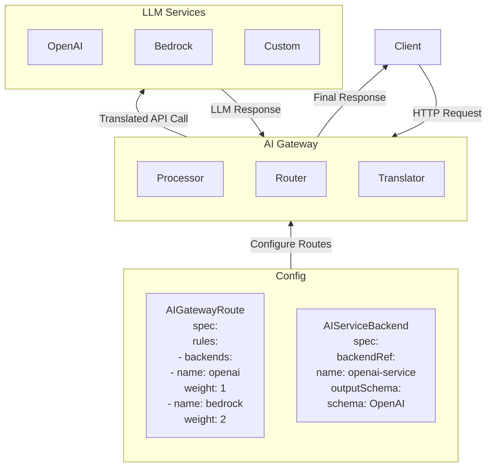

# LLM AI Gateway

# Introduction
The AI Gateway currently provides:

- Basic routing between different LLM providers (OpenAI, AWS Bedrock)
- Protocol translation between different API formats
- Basic authentication and rate limiting
- Simple routing based on model names and header matching

As illustrated in the following diagram, the lifecycle of the LLM request is as follows:

- Client sends request to Envoy and AI Gateway
- Gateway routes based on basic model name matching
- Translates API formats as needed
- Forwards to appropriate LLM backend
- Returns response to Envoy and client

# Developer Guide

## Local Development Environment

Please refer to [Developer Guide](developer_guide.md) for detailed instructions on setting up the local development environment.