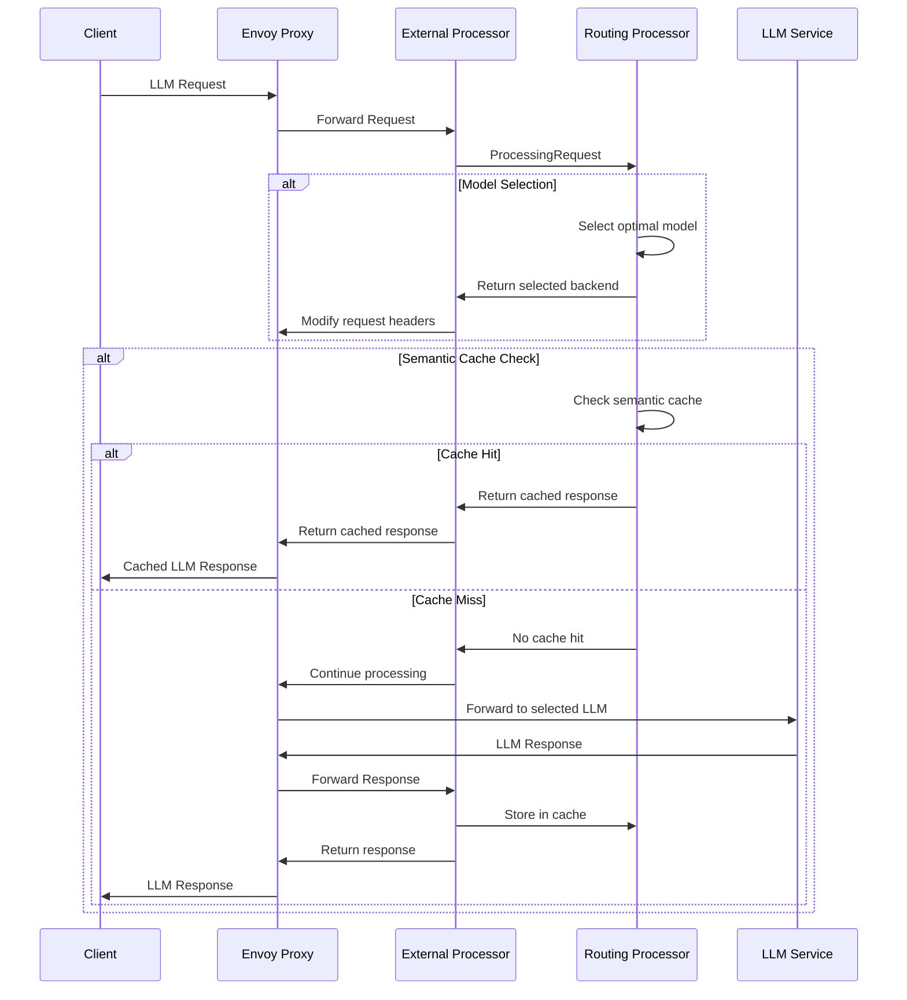
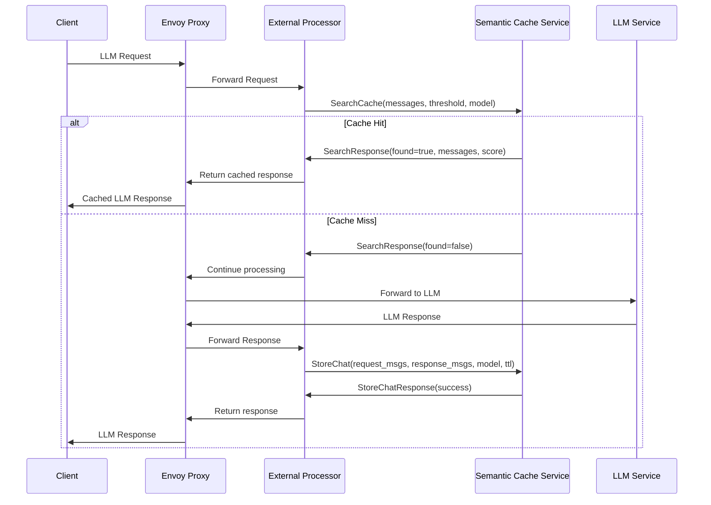
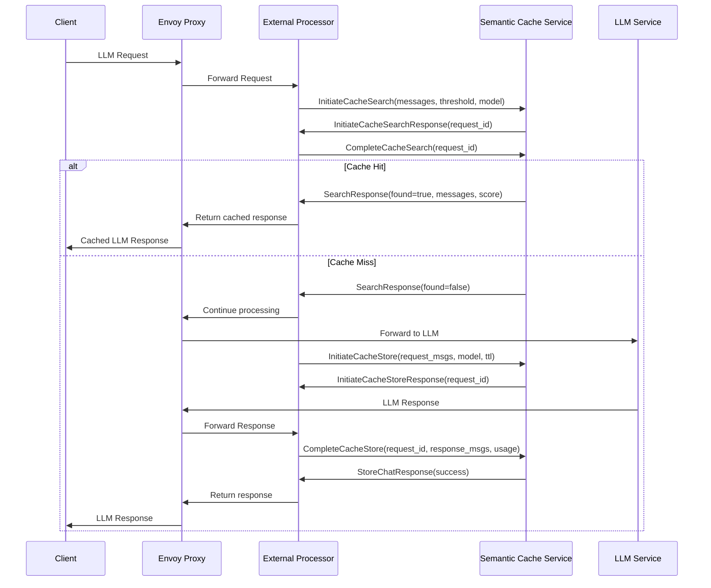

# External Routing Processor Service for Auto Model Selection and Semantic Caching

## Introduction

The following design is for extending the AI Gateway to support model selection and semantic caching for LLM inference. Both will be key features in optimizing latency, cost, and scalability of LLM services by intelligent routing of the requests and semantic similarity caching.

## Goals

- Smart model selection: route requests based on characteristics and metrics from the backends
- Semantic caching to reduce latency and cost
- Compatibility with the current AI Gateway architecture
- Multi-provider and multi-model type support
- Custom router implementation

Non-Goals:

- Non LLM inference types
- Deploying Models, Managing scaling

## Overview

The AI Gateway currently routes requests to the LLM service based on the model name provided in the request. The new service will provide the functionality to make routing decisions and to cache the information needed to optimize the routing, based on:

- Model Selection: Route requests accordingly to their level of complexity, taking semantic meaning and current metrics on the backend into account
- Semantic Caching: Stores and retrieves responses basing on the semantic similarity between prompts

## Design

### Protocol

Please find the proposed protocol in [routing_processor.proto](routing_processor.proto)

### External Processor and Routing Processor Relationship

The following diagram illustrates the relationship between the External Processor (extproc) and the Routing Processor:

### Cache Types

There are two types of cache:

- Stateless semantic cache. This cache is used to cache responses based on the semantic similarity between the request and response.
- Stateful semantic cache. Instead of using the full request each time to query the cache, a stateful cache will generate a unique identifier for the request when querying the cache. And then use the same identifier to retrieve the original request and then store the request and response pair to the cache.

### Stateless Semantic Cache

The stateless semantic cache provides a simple request-response pattern for cache operations:

### Stateful Semantic Cache

The stateful semantic cache provides asynchronous operations for better performance and scalability:

### Model Selection

Model selection operates by:

1. Scoring incoming requests for their complexity and needs
2. Optionally, tracking performance metrics of backends (latencies, rate limits, costs)
3. Making routing decisions based on configurable policies

A model routing PoC can be found [here](https://docs.google.com/document/d/1DVZJS1LC3O3CqokSWoguknLqD-qc467BOyUxTixqQ4c/edit?usp=sharing)

### Semantic Caching

The semantic cache:

- Given a request and response, generates embeddings
- Stores request and response along with its embeddings
- Performed similarity matching for cache lookups
- Handles eviction of cache both based on provided rention period and storage limit

A semantic cache PoC can be found [here](https://github.com/envoyproxy/ai-gateway/commit/a622ffcd366915b774115f1d4ab72b83a70cb653) with a [demo](https://asciinema.org/a/704430)

### Error Handling

System will handle the following types of failure:

- Cache failures: Will degrade to routing directly into the model.
- Model selection failures: Fallback to specified default model

## Future Work

- Basic model selection
- Semantic caching
- Investigate more features such as prefix cache aware routing
- Custom router implementation
- Error handling and metrics
- Documentation and examples
